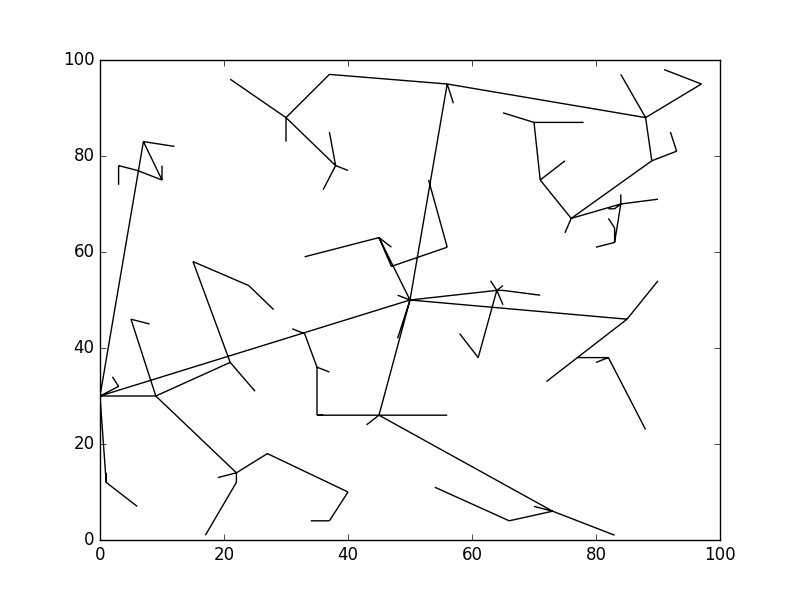
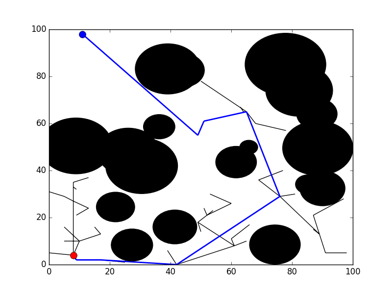
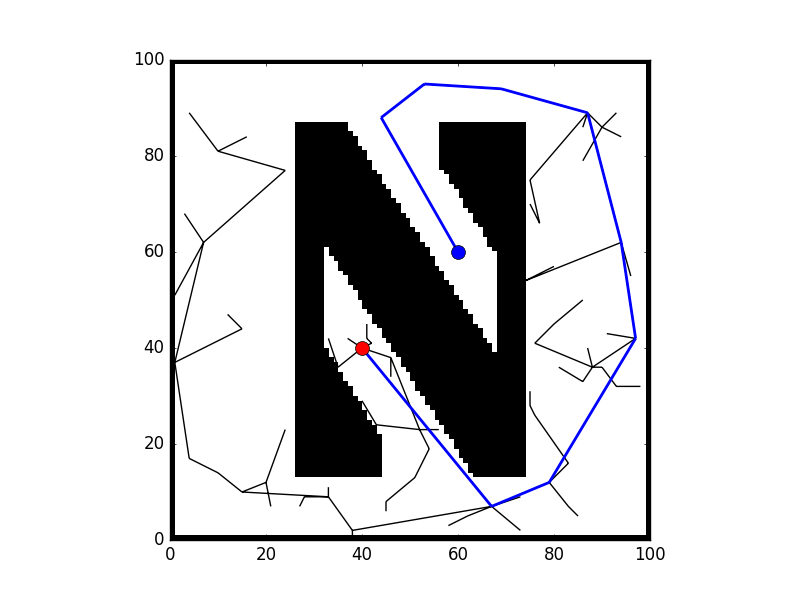

## RRT Challenges
**Michael Wiznitzer**

Northwestern University MSR Hackathon (Fall 2017)

## Introduction
#### Objective
To complete 3 challenges that implement the [ RRT algorithm](https://en.wikipedia.org/wiki/Rapidly-exploring_random_tree) in various ways. The 3 challenges are:
 1. To create a simple tree with _N_ number of nodes starting from the center of a 100x100 plot
 2. To find a path from _Point A_ to _Point B_ in a plot with 20 randomly generated circles used as obstacles
 3. To find a path from _Point A_ to _point B_ in a binary image of the Northwestern "N" symbol shown below

 

#### Simple RRT Tree
A tree created with a 100 nodes is shown below

#### Circle RRT Path
A tree created from _Point A_ to _point B_ is shown below. The path found that navigates between the circle obstacles is colored in blue.

#### N RRT Path
A tree created from _Point A_ to _point B_ is shown below. The path found that navigates the "N" symbol is colored in blue.

## Implementation
Simple clone the package and run in an ipython shell ``%run rrt_challenges.py``.

All 3 challenges are run consecutively so in order to run the next challenge, close the figure that pops up after each challenge.
